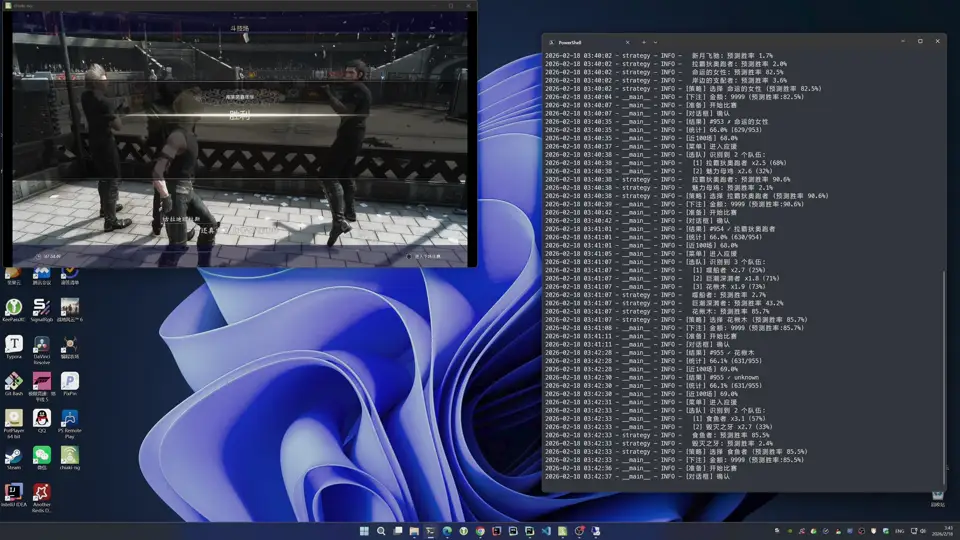
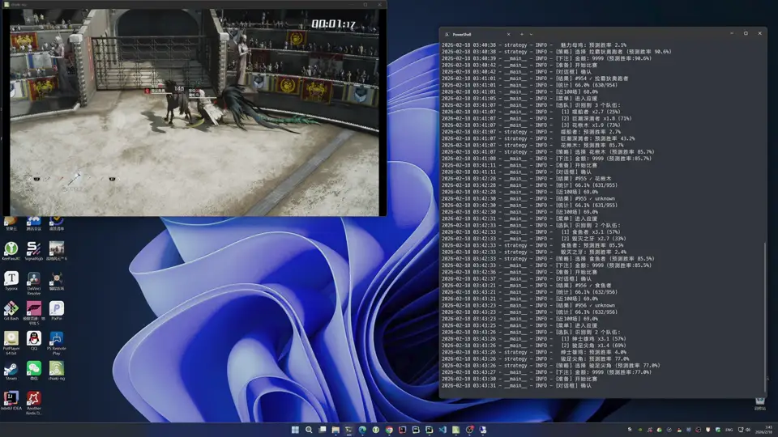

# Totomostro Bot

最终幻想15（FF15 / Final Fantasy XV）水都竞技场（Totomostro）自动挂机脚本。

适用于 PS 平台国行版 FF15。

## 演示

下注：



观战&应援：



## 功能特点

- 通过虚拟 DS4 手柄自动控制游戏
- EasyOCR 识别游戏状态、队伍信息、比赛结果
- 机器学习预测胜率，智能选队
- 根据预测胜率动态调整下注金额
- SQLite 存储历史数据，支持统计分析
- 自动检测应援时机并按键

## 测试环境

- Windows 11
- 分辨率 3840x2160 ，缩放 150%
- PlayStation 5 Pro
- 国行皇家版 FF15
- Python 3.12.12
- [chiaki-ng](https://github.com/streetpea/chiaki-ng)
- NVIDIA GPU + CUDA （可选，加速 OCR）

## 安装

需要先安装 [uv](https://docs.astral.sh/uv/getting-started/installation/)

```shell
# 安装依赖（使用 uv）
uv sync

# 初始化数据库
uv run alembic upgrade head
```

## 使用

1. 启动  chiaki-ng，连接 PS 主机
2. 进入水都竞技场主菜单
3. 运行：

```
uv run ./src/main.py
```

按<kbd>Ctrl</kbd>+<kbd>C</kbd>停止

## 工作原理

1. 通过 chiaki-ng 截取 PS 主机画面
2. 通过 EasyOCR 进行文字识别
3. 程序判断状态后给出对应操作
   * 本质为状态机
   * 下注金额会随预测胜率变化
4. 通过虚拟 DS4 手柄给出按键指令

## 注意事项

- PS Remote Play限制了模拟手柄，因此需要选择 chiaki-ng
- 游戏为国行版
  - 游戏内按键为O确认，X取消
  - 游戏中的语言为简体中文
- 测试时使用的电脑为4K分辨率，若分辨率不同可能需要再调整
- 需要有一定基础储备资金

## License

MIT

